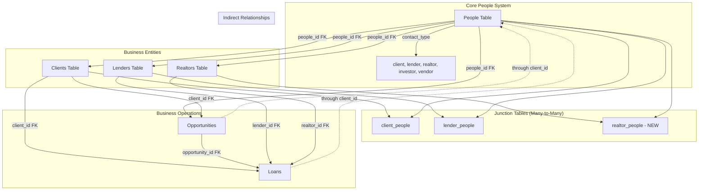
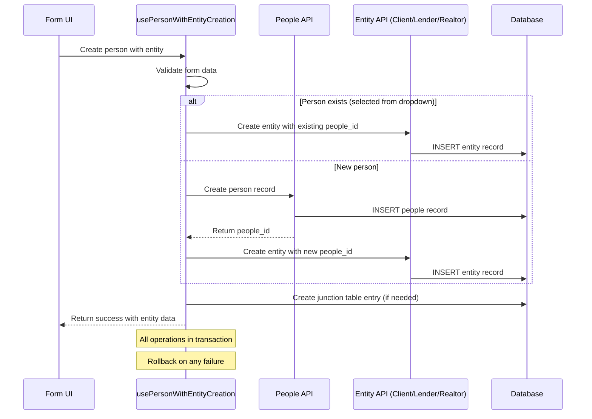

# People-Client-Lender Integration Design

## Overview

This design document outlines the technical approach for implementing a unified people management system that serves as the foundation for all business entity relationships (clients, lenders, realtors). The solution addresses current architectural inconsistencies and provides a scalable framework for managing complex business relationships in the mortgage broker platform.

The design emphasizes a people-centric architecture where all business entities reference the people table as their authoritative source of contact information, with opportunities and loans connecting indirectly through their respective entity relationships.

## Architecture

### High-Level Architecture



### Data Flow Architecture



## Components and Interfaces

### Core Hook: usePersonWithEntityCreation

```typescript
interface PersonWithEntityCreationOptions {
  entityType: 'client' | 'lender' | 'realtor';
  personData: PersonFormData;
  entityData: ClientFormData | LenderFormData | RealtorFormData;
  existingPersonId?: string; // For selecting existing person
}

interface PersonWithEntityCreationResult {
  createPersonWithEntity: (options: PersonWithEntityCreationOptions) => Promise<EntityResult>;
  isCreating: boolean;
  error: string | null;
}

const usePersonWithEntityCreation = (): PersonWithEntityCreationResult => {
  // Implementation details
};
```

### Form Components Architecture

```typescript
// Base person selector component
interface PersonSelectorProps {
  onPersonSelect: (person: Person | null) => void;
  contactType: ContactType;
  placeholder?: string;
}

// Enhanced form components
interface EnhancedEntityFormProps {
  mode: 'create' | 'edit';
  initialData?: Partial<EntityData>;
  onSubmit: (data: EntityFormData) => void;
  showPersonSelector?: boolean; // For create mode
}

// Form data interfaces
interface PersonFormData {
  contact_type: ContactType;
  first_name: string;
  last_name: string;
  email_primary: string;
  phone_primary?: string;
  company_name?: string;
  // ... other person fields
}

interface ClientFormData extends PersonFormData {
  client_type: 'residential' | 'commercial' | 'investor';
  annual_income?: number;
  credit_score?: number;
  // ... client-specific fields
}
```

### Database Schema Enhancements

#### New Junction Table: realtor_people

```sql
CREATE TABLE realtor_people (
  id UUID PRIMARY KEY DEFAULT gen_random_uuid(),
  realtor_id UUID NOT NULL REFERENCES realtors(id) ON DELETE CASCADE,
  person_id UUID NOT NULL REFERENCES people(id) ON DELETE CASCADE,
  user_id UUID NOT NULL REFERENCES auth.users(id),
  is_primary BOOLEAN DEFAULT false,
  relationship_type TEXT DEFAULT 'contact',
  created_at TIMESTAMPTZ DEFAULT timezone('utc', now()),
  updated_at TIMESTAMPTZ DEFAULT timezone('utc', now()),
  
  UNIQUE(realtor_id, person_id)
);
```

#### Enhanced Indexes for Performance

```sql
-- Composite indexes for efficient queries
CREATE INDEX idx_people_user_contact_type ON people(user_id, contact_type);
CREATE INDEX idx_clients_people_user ON clients(people_id, user_id);
CREATE INDEX idx_lenders_people_user ON lenders(people_id, user_id);
CREATE INDEX idx_realtors_people_user ON realtors(people_id, user_id);

-- Junction table indexes
CREATE INDEX idx_client_people_client_primary ON client_people(client_id, is_primary);
CREATE INDEX idx_lender_people_lender_primary ON lender_people(lender_id, is_primary);
CREATE INDEX idx_realtor_people_realtor_primary ON realtor_people(realtor_id, is_primary);
```

## Data Models

### Core Person Model

```typescript
interface Person {
  id: string;
  user_id: string;
  contact_type: 'client' | 'lender' | 'realtor' | 'investor' | 'vendor' | 'referral_source' | 'other';
  first_name: string;
  last_name: string;
  company_name?: string;
  title_position?: string;
  email_primary: string;
  email_secondary?: string;
  phone_primary?: string;
  phone_secondary?: string;
  address_street?: string;
  address_city?: string;
  address_state?: string;
  address_zip?: string;
  preferred_communication_method?: 'email' | 'phone' | 'text' | 'linkedin';
  last_contact_date?: string;
  next_follow_up_date?: string;
  relationship_strength_score?: number; // 1-10
  contact_source?: string;
  tags?: string[];
  notes?: string;
  status: 'active' | 'inactive' | 'prospect';
  created_at: string;
  updated_at: string;
}
```

### Enhanced Entity Models

```typescript
interface Client extends Person {
  // Client-specific fields
  client_type: 'residential' | 'commercial' | 'investor';
  client_status: 'active' | 'inactive' | 'prospect' | 'archived';
  annual_income?: number;
  credit_score?: number;
  debt_to_income_ratio?: number;
  first_time_buyer?: boolean;
  veteran_status?: boolean;
  // ... other client fields
}

interface Lender extends Person {
  // Lender-specific fields
  name: string; // Institution name
  type: string; // Bank, Credit Union, etc.
  status: string;
  notes?: string;
}

interface Realtor extends Person {
  // Realtor-specific fields
  license_number?: string;
  license_state?: string;
  brokerage_name?: string;
  specialty_areas?: string[];
  years_experience?: number;
  performance_rating?: number; // 1-10
  // ... other realtor fields
}
```

### Junction Table Models

```typescript
interface ClientPerson {
  id: string;
  client_id: string;
  person_id: string;
  user_id: string;
  is_primary: boolean;
  relationship_type: 'primary_client' | 'co_borrower' | 'spouse' | 'business_partner' | 'family_member' | 'guarantor' | 'investor_partner' | 'property_manager' | 'accountant' | 'attorney';
  relationship_notes?: string;
  contact_preference?: 'email' | 'phone' | 'text' | 'mail';
  is_authorized_contact: boolean;
  created_at: string;
  updated_at: string;
}

interface LenderPerson {
  id: string;
  lender_id: string;
  person_id: string;
  user_id: string;
  is_primary: boolean;
  relationship_type: string;
  created_at: string;
  updated_at: string;
}

interface RealtorPerson {
  id: string;
  realtor_id: string;
  person_id: string;
  user_id: string;
  is_primary: boolean;
  relationship_type: string;
  created_at: string;
  updated_at: string;
}
```

## Error Handling

### Transaction Management

```typescript
const createPersonWithEntity = async (options: PersonWithEntityCreationOptions) => {
  const { data, error } = await supabase.rpc('create_person_with_entity', {
    person_data: options.personData,
    entity_data: options.entityData,
    entity_type: options.entityType,
    existing_person_id: options.existingPersonId
  });
  
  if (error) {
    // Handle specific error types
    if (error.code === '23505') { // Unique constraint violation
      throw new Error('A person with this email already exists');
    }
    if (error.code === '23503') { // Foreign key violation
      throw new Error('Invalid reference data provided');
    }
    throw new Error(`Database error: ${error.message}`);
  }
  
  return data;
};
```

### Database Function for Atomic Operations

```sql
CREATE OR REPLACE FUNCTION create_person_with_entity(
  person_data JSONB,
  entity_data JSONB,
  entity_type TEXT,
  existing_person_id UUID DEFAULT NULL
) RETURNS JSONB AS $$
DECLARE
  person_id UUID;
  entity_id UUID;
  result JSONB;
BEGIN
  -- Start transaction
  BEGIN
    -- Use existing person or create new one
    IF existing_person_id IS NOT NULL THEN
      person_id := existing_person_id;
    ELSE
      INSERT INTO people (user_id, contact_type, first_name, last_name, email_primary, phone_primary, company_name)
      VALUES (
        (person_data->>'user_id')::UUID,
        person_data->>'contact_type',
        person_data->>'first_name',
        person_data->>'last_name',
        person_data->>'email_primary',
        person_data->>'phone_primary',
        person_data->>'company_name'
      )
      RETURNING id INTO person_id;
    END IF;
    
    -- Create entity based on type
    CASE entity_type
      WHEN 'client' THEN
        INSERT INTO clients (user_id, people_id, client_type, annual_income, credit_score)
        VALUES (
          (entity_data->>'user_id')::UUID,
          person_id,
          entity_data->>'client_type',
          (entity_data->>'annual_income')::NUMERIC,
          (entity_data->>'credit_score')::INTEGER
        )
        RETURNING id INTO entity_id;
        
      WHEN 'lender' THEN
        INSERT INTO lenders (user_id, people_id, name, type, status)
        VALUES (
          (entity_data->>'user_id')::UUID,
          person_id,
          entity_data->>'name',
          entity_data->>'type',
          entity_data->>'status'
        )
        RETURNING id INTO entity_id;
        
      WHEN 'realtor' THEN
        INSERT INTO realtors (user_id, people_id, license_number, brokerage_name)
        VALUES (
          (entity_data->>'user_id')::UUID,
          person_id,
          entity_data->>'license_number',
          entity_data->>'brokerage_name'
        )
        RETURNING id INTO entity_id;
    END CASE;
    
    -- Create junction table entry if needed (for primary contact)
    CASE entity_type
      WHEN 'client' THEN
        INSERT INTO client_people (client_id, person_id, user_id, is_primary, relationship_type)
        VALUES (entity_id, person_id, (entity_data->>'user_id')::UUID, true, 'primary_client');
        
      WHEN 'lender' THEN
        INSERT INTO lender_people (lender_id, person_id, user_id, is_primary, relationship_type)
        VALUES (entity_id, person_id, (entity_data->>'user_id')::UUID, true, 'contact');
        
      WHEN 'realtor' THEN
        INSERT INTO realtor_people (realtor_id, person_id, user_id, is_primary, relationship_type)
        VALUES (entity_id, person_id, (entity_data->>'user_id')::UUID, true, 'contact');
    END CASE;
    
    -- Return success result
    result := jsonb_build_object(
      'success', true,
      'person_id', person_id,
      'entity_id', entity_id,
      'entity_type', entity_type
    );
    
    RETURN result;
    
  EXCEPTION WHEN OTHERS THEN
    -- Rollback handled automatically
    RETURN jsonb_build_object(
      'success', false,
      'error', SQLERRM,
      'error_code', SQLSTATE
    );
  END;
END;
$$ LANGUAGE plpgsql SECURITY DEFINER;
```

### Error Recovery Strategies

1. **Partial Failure Recovery**: If entity creation fails after person creation, provide option to retry entity creation or link to existing entity
2. **Constraint Violation Handling**: Detect duplicate emails/phones and offer to update existing records
3. **Network Error Resilience**: Implement retry logic with exponential backoff
4. **User Feedback**: Clear error messages with actionable recovery steps

## Testing Strategy

### Unit Tests

```typescript
describe('usePersonWithEntityCreation', () => {
  it('should create person and client atomically', async () => {
    const { result } = renderHook(() => usePersonWithEntityCreation());
    
    const options = {
      entityType: 'client' as const,
      personData: mockPersonData,
      entityData: mockClientData
    };
    
    await act(async () => {
      await result.current.createPersonWithEntity(options);
    });
    
    expect(mockSupabaseRpc).toHaveBeenCalledWith('create_person_with_entity', {
      person_data: mockPersonData,
      entity_data: mockClientData,
      entity_type: 'client',
      existing_person_id: undefined
    });
  });
  
  it('should handle existing person selection', async () => {
    const { result } = renderHook(() => usePersonWithEntityCreation());
    
    const options = {
      entityType: 'lender' as const,
      personData: mockPersonData,
      entityData: mockLenderData,
      existingPersonId: 'existing-person-id'
    };
    
    await act(async () => {
      await result.current.createPersonWithEntity(options);
    });
    
    expect(mockSupabaseRpc).toHaveBeenCalledWith('create_person_with_entity', {
      person_data: mockPersonData,
      entity_data: mockLenderData,
      entity_type: 'lender',
      existing_person_id: 'existing-person-id'
    });
  });
});
```

### Integration Tests

```typescript
describe('Person-Entity Integration', () => {
  it('should create complete client workflow', async () => {
    // Test full user journey from form submission to database
    render(<EnhancedAddClientForm />);
    
    // Fill out person information
    fireEvent.change(screen.getByLabelText('First Name'), { target: { value: 'John' } });
    fireEvent.change(screen.getByLabelText('Last Name'), { target: { value: 'Doe' } });
    fireEvent.change(screen.getByLabelText('Email'), { target: { value: 'john@example.com' } });
    
    // Fill out client-specific information
    fireEvent.change(screen.getByLabelText('Annual Income'), { target: { value: '75000' } });
    fireEvent.change(screen.getByLabelText('Credit Score'), { target: { value: '720' } });
    
    // Submit form
    fireEvent.click(screen.getByText('Create Client'));
    
    // Verify success
    await waitFor(() => {
      expect(screen.getByText('Client created successfully')).toBeInTheDocument();
    });
    
    // Verify database state
    const clients = await supabase.from('clients').select('*, people(*)');
    expect(clients.data).toHaveLength(1);
    expect(clients.data[0].people.first_name).toBe('John');
  });
});
```

### Performance Tests

```typescript
describe('Performance Tests', () => {
  it('should handle concurrent person creation', async () => {
    const promises = Array.from({ length: 10 }, (_, i) => 
      createPersonWithEntity({
        entityType: 'client',
        personData: { ...mockPersonData, email_primary: `test${i}@example.com` },
        entityData: mockClientData
      })
    );
    
    const results = await Promise.allSettled(promises);
    const successful = results.filter(r => r.status === 'fulfilled');
    
    expect(successful).toHaveLength(10);
  });
  
  it('should maintain query performance under load', async () => {
    const startTime = Date.now();
    
    const { data } = await supabase
      .from('clients')
      .select('*, people(*)')
      .eq('user_id', userId)
      .limit(100);
    
    const queryTime = Date.now() - startTime;
    expect(queryTime).toBeLessThan(100); // Sub-100ms requirement
  });
});
```

## Implementation Phases

### Phase 1: Database Schema Updates
1. Create `realtor_people` junction table
2. Add necessary indexes for performance
3. Create database functions for atomic operations
4. Update RLS policies for new table

### Phase 2: Core Hook Development
1. Implement `usePersonWithEntityCreation` hook
2. Add comprehensive error handling
3. Implement transaction management
4. Add optimistic updates support

### Phase 3: UI Component Updates
1. Create `PersonSelector` component
2. Update entity form components to support person selection
3. Implement form validation and error display
4. Add loading states and user feedback

### Phase 4: Integration and Testing
1. Integrate hooks with existing improved hooks
2. Update all entity creation workflows
3. Comprehensive testing suite
4. Performance optimization and monitoring

## Success Metrics

### Functional Metrics
- 100% of person creations result in appropriate entity creation
- Zero orphaned person records after implementation
- All user workflows complete successfully without manual intervention

### Performance Metrics
- Database queries complete in <100ms (95th percentile)
- Form submissions complete in <200ms perceived time
- No memory leaks or performance degradation over time

### User Experience Metrics
- Consistent behavior across all entity creation forms
- Clear error messages with >90% user comprehension
- Successful task completion rate >95%

### Technical Metrics
- Code coverage >90% for all new components
- Zero critical security vulnerabilities
- Successful deployment with zero downtime